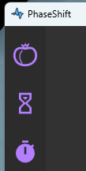
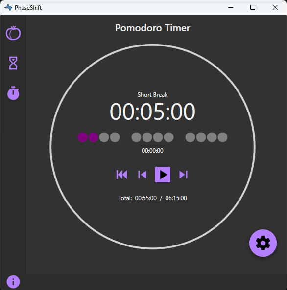
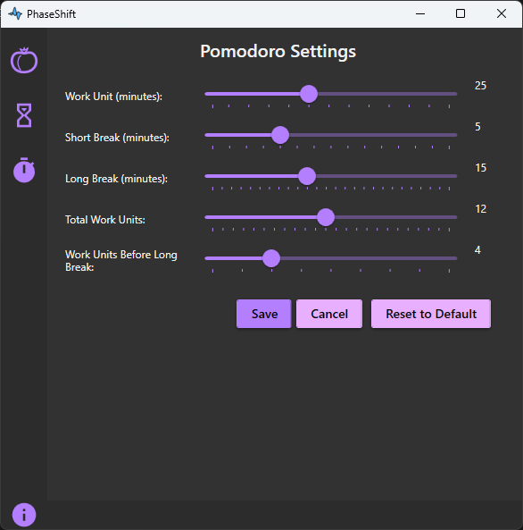
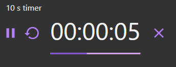
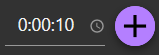
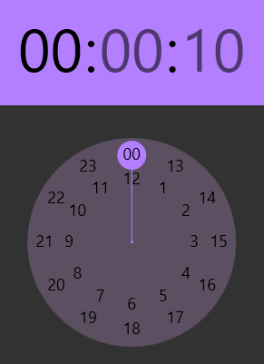
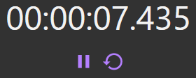
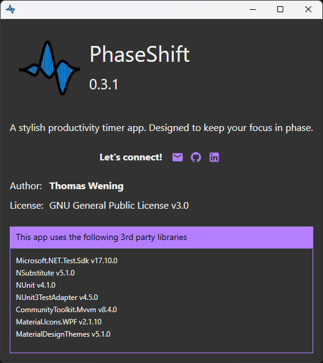

# PhaseShift User Guide

This is the full user guide for PhaseShift. It provides a detailed explanation of all features, views, and controls. If you're looking for a quick overview to get started, you can also check out the [Quick Start Guide](./quickstart.md).

## 📑 Table of Contents

- [Introduction](#1️⃣-introduction)
- [Navigation](#2️⃣-navigation)
- [Pomodoro Timer](#3️⃣-pomodoro-timer)
  - [What is the Pomodoro Technique?](#what-is-the-pomodoro-technique)
  - [Pomodoro Timer View](#pomodoro-timer-view)
- [Pomodoro Settings](#️pomodoro-settings)
- [Custom Timers](#4️⃣-custom-timers)
  - [Timer Control](#timer-control)
  - [Adding Timers](#adding-timers)
- [Stopwatch](#5️⃣-stopwatch)
- [About & Status Bar](#6️⃣-about--status-bar)
  - [Status Bar](#status-bar)
  - [About Section](#about-section)

## 1️⃣ Introduction

PhaseShift is a simple and elegant productivity timer that helps you stay focused. You can use it to:

- Structure your work using the **Pomodoro Technique**
- Measure time with a **Stopwatch**
- Set individual **Custom Timers** for any task

No installation is needed. Just [download the executable](https://github.com/thomaswening/PhaseShift/releases/latest) and run it.

## 2️⃣ Navigation

The left-hand navigation panel lets you switch between features:

Top to bottom:
- Pomodoro Timer
- Timers Overview
- Stopwatch

## 3️⃣ Pomodoro Timer

### What is the Pomodoro Technique?

The Pomodoro Technique is a simple time management method:
- Work in focused intervals (typically 25 minutes)
- Take short breaks between intervals
- After a few intervals, take a longer break

This is very helpful for staying focused, especially for tasks that feel dull or overwhelming.

### Pomodoro Timer View

When you start PhaseShift, you will see the **Pomodoro Timer** view first.

**From top to bottom:**

- **Current Phase Name:** Displays if you are in Work, Short Break, or Long Break.
- **Remaining Time:** Shows the time left in the current phase.
- **Work Units Representation:**  
    
  Each disk represents a work unit. Completed units are filled. Small gaps represent short breaks, larger gaps represent long breaks.
- **Elapsed Time in Current Phase:** Time that has already passed during the current phase.
- **Pomodoro Control Buttons:**  
    
  - Reset Session: Resets the Pomodoro session to the first work unit.
  - Reset Phase: Restarts the current phase.
  - Start/Pause: Starts or pauses the timer.
  - Skip Phase: Immediately switches to the next phase.
- **Elapsed Time in Session / Total Session Duration:** Displays how much of the session is completed.
- **Progress Circle:** Visual representation of how much time has passed in the current phase.
- **Settings Button:** Bottom-right corner opens Pomodoro settings.

## Pomodoro Settings

Accessible via the settings button:

You can configure:
- Work Unit duration (minutes)
- Short Break duration (minutes)
- Long Break duration (minutes, cannot be shorter than short break)
- Total Work Units per session
- Work Units before Long Break

**Behavior:**
- If long break equals short break, or if work units before long break is 1 or greater than total work units, all breaks are short.
- You can update settings while the timer is running.
- Elapsed session time stays as-is even if phase durations change.
- Reducing phase duration below elapsed time will complete the phase.
- Reducing total work units below already completed units will complete the session.
- **Note:** Currently, settings are not saved after closing the app.

## 4️⃣ Custom Timers

The **Timers** view allows you to create simple countdown timers.

### Timer Control

- **Title:** Automatically generated from timer duration, but can be edited.
- **Buttons (left to right):** Start/Pause, Reset, Remaining Time, Delete Timer.
- **Progress Bar:** Fills up as the timer progresses.

### Adding Timers

Bottom-right corner:

- Set the duration (can be typed).
- Use graphical interface for easier input:  
  
- Click the plus button to add the timer.

**Note:** Currently, timers are not persisted after closing the app.

## 5️⃣ Stopwatch

A simple stopwatch to measure elapsed time:

- Shows time with millisecond precision.
- Buttons below: Start/Pause, Reset.

**Note:** Splits and rounds are not yet supported.

## 6️⃣ About & Status Bar

### Status Bar

At the bottom of the window:

- Left: Info button to open the About section.
- Right: Displays summary of running timers:
  - Stopwatch: Elapsed time.
  - Timers: Next timer due and active timers.
  - Pomodoro: Current phase and time remaining.

### About Section

The **About section** shows:

- The current app version and a short description.
- Author information and license.
- Quick links to contact or visit the project's GitHub and LinkedIn pages.
- A list of 3rd party libraries used in the project with their versions.
